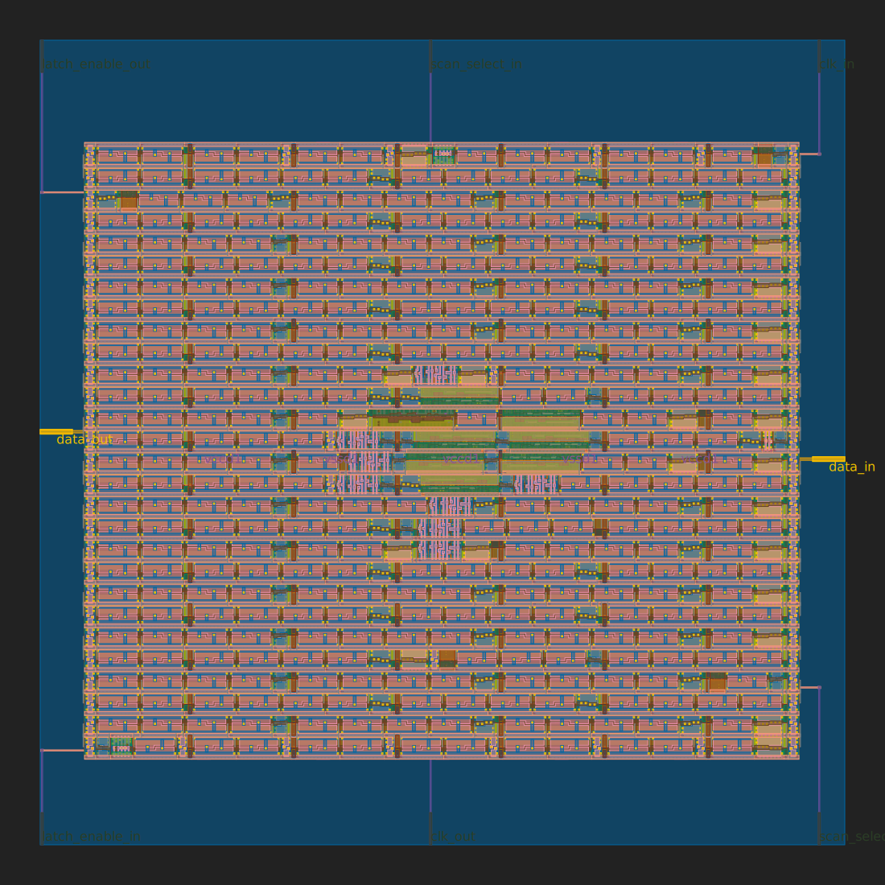
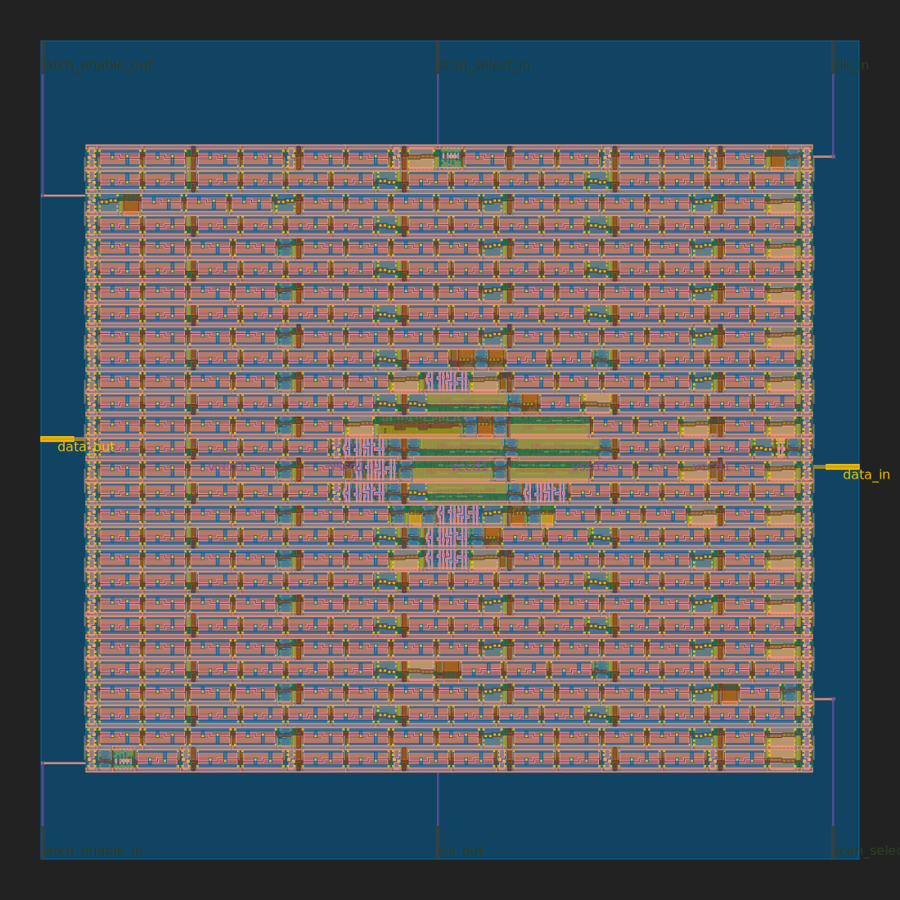
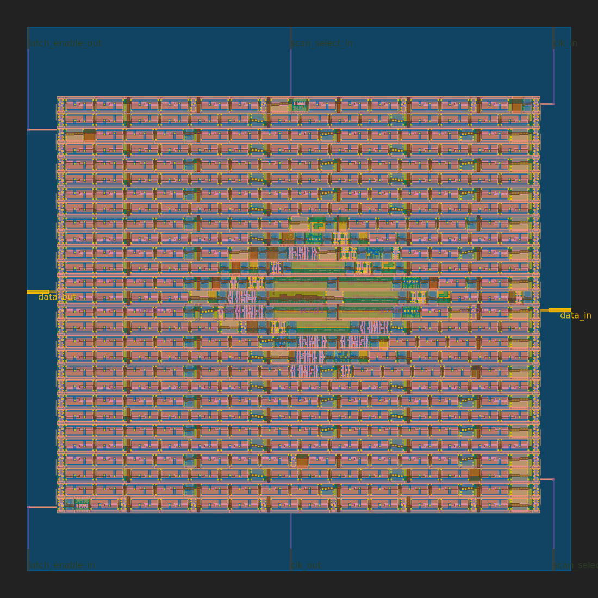
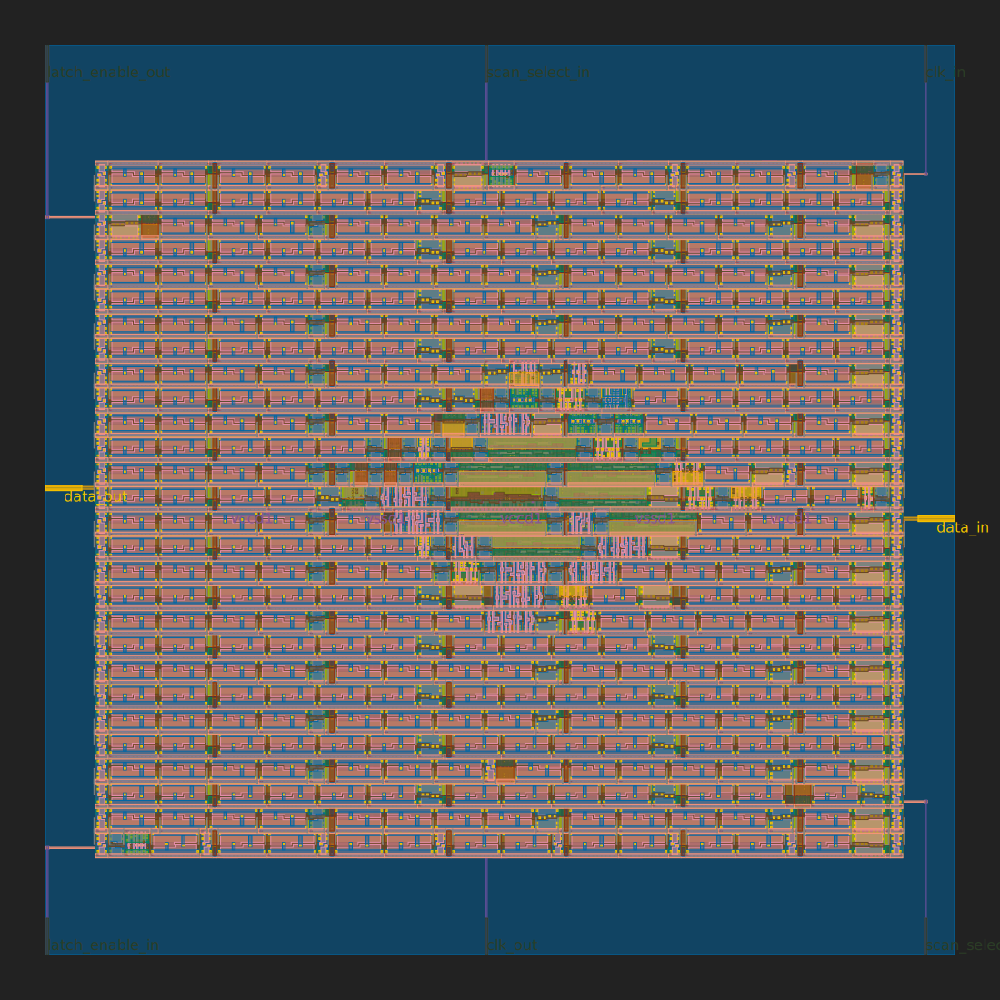

# XLS template for TinyTapeout

Template for submitting [TinyTapeout](https://tinytapeout.com) designs based on [XLS: Accelerated HW Synthesis](https://github.com/google/xls) toolkit.

## Usage

1. [Generate](https://github.com/proppy/tinytapeout-xls-test/generate) a new project based on this template

2. Create a new [Wokwi](https://wokwi.com/) project ID and update [WOKWI_PROJECT_ID](Makefile#L1).

3. Modify [src/user_module.x](src/user_module.x) ([DSLX language reference](https://google.github.io/xls/dslx_reference/))

	```
	pub fn user_module(io_in: u8) -> u8 {
	  io_in
	}

	#![test]
	fn user_module_test() {
	  let _= assert_eq(user_module(u8:0b0010_1010), u8:42);
	  _
	}
	```

4. Push and check the [](https://github.com/proppy/tinytapeout-xls-test/actions/workflows/wokwi.yaml) action artefacts.

    - `src/user_module.v`: generated verilog
	
		```
		module user_module_USER_MODULE_ID(
		  input wire [7:0] io_in,
		  output wire [7:0] out
		);
		  assign out = io_in;
		endmodule
		```
	
	- `gds_render.svg`: GDS preview
	
        

5. Goto 3 until satisfied

6. Submit the TinyTapeout [form](https://docs.google.com/forms/d/e/1FAIpQLSc3ZF0AHKD3LoZRSmKX5byl-0AzrSK8ADeh0DtkZQX0bbr16w/viewform)

### Examples

#### 8-bit inverter

[](https://colab.research.google.com/github/proppy/tinytapeout-xls-test/blob/main/notebooks/inverter.ipynb)

```
fn inverter(n: u8) -> u8 {
  !n
}

#![test]
fn inverter_test() {
  let _= assert_eq(inverter(u8:0b0000_0000), u8:0b1111_1111);
  let _= assert_eq(inverter(u8:0b0000_0001), u8:0b1111_1110);
  let _= assert_eq(inverter(u8:0b1111_0000), u8:0b0000_1111);
  let _= assert_eq(inverter(u8:0b0101_0101), u8:0b1010_1010);
  let _= assert_eq(inverter(u8:0b1111_1111), u8:0b0000_0000);
  _
}

pub fn user_module(io_in: u8) -> u8 {
  inverter(io_in)
}
```



#### 8-bit population count

[](https://colab.research.google.com/github/proppy/tinytapeout-xls-test/blob/main/notebooks/popcount.ipynb)

```
fn popcount(n: u8) -> u8 {
  for (i, c): (u8, u8) in u8:0..u8:8 {
    c + ((n >> i) & u8:1)
  }(u8:0)
}

#![test]
fn popcount_test() {
  let _= assert_eq(popcount(u8:0b0000_0000), u8:0);
  let _= assert_eq(popcount(u8:0b0000_0001), u8:1);
  let _= assert_eq(popcount(u8:0b1111_0000), u8:4);
  let _= assert_eq(popcount(u8:0b0101_0101), u8:4);
  let _= assert_eq(popcount(u8:0b1111_1111), u8:8);
  _
}

pub fn user_module(io_in: u8) -> u8 {
  popcount(io_in)
}
```



#### 8-bit population count with [bit twiddling hacks](https://graphics.stanford.edu/~seander/bithacks.html#CountBitsSetParallel)

[](https://colab.research.google.com/github/proppy/tinytapeout-xls-test/blob/main/notebooks/popcount_bithacks.ipynb) 

```
// https://graphics.stanford.edu/~seander/bithacks.html#CountBitsSetParallel
fn popcount(v: u8) -> u8 {
  let v = v - ((v >> 1) & u8:0x55);
  let v = (v & u8:0x33) + ((v >> 2) & u8:0x33);
  (v + (v >> 4) & u8:0x0F)
}

#![test]
fn popcount_test() {
  let _= assert_eq(popcount(u8:0b0000_0000), u8:0);
  let _= assert_eq(popcount(u8:0b0000_0001), u8:1);
  let _= assert_eq(popcount(u8:0b1111_0000), u8:4);
  let _= assert_eq(popcount(u8:0b0101_0101), u8:4);
  let _= assert_eq(popcount(u8:0b1111_1111), u8:8);
  _
}

pub fn user_module(io_in: u8) -> u8 {
  popcount(io_in)
}
```



# How to change the Wokwi project

Edit the [Makefile](Makefile) and change the WOKWI_PROJECT_ID to match your project.

# What is this about?

This repo is a template you can make a copy of for your own [ASIC](https://www.zerotoasiccourse.com/terminology/asic/) design using [Wokwi](https://wokwi.com/).

When you edit the Makefile to choose a different ID, the [GitHub Action](.github/workflows/wokwi.yaml) will fetch the digital netlist of your design from Wokwi.

The design gets wrapped in some extra logic that builds a 'scan chain'. This is a way to put lots of designs onto one chip and still have access to them all. You can see [all of the technical details here](https://github.com/mattvenn/scan_wrapper).

After that, the action uses the open source ASIC tool called [OpenLane](https://www.zerotoasiccourse.com/terminology/openlane/) to build the files needed to fabricate an ASIC.

# What files get made?

When the action is complete, you can [click here](https://github.com/mattvenn/wokwi-verilog-gds-test/actions) to see the latest build of your design. You need to download the zip file and take a look at the contents:

* gds_render.svg - picture of your ASIC design
* gds.html - zoomable picture of your ASIC design
* runs/wokwi/reports/final_summary_report.csv  - CSV file with lots of details about the design
* runs/wokwi/reports/synthesis/1-synthesis.stat.rpt.strategy4 - list of the [standard cells](https://www.zerotoasiccourse.com/terminology/standardcell/) used by your design
* runs/wokwi/results/final/gds/user_module.gds - the final [GDS](https://www.zerotoasiccourse.com/terminology/gds2/) file needed to make your design

# What next?

* Share your GDS on twitter, tag it #tinytapeout and [link me](https://twitter.com/matthewvenn)!
* [Submit it to be made](https://docs.google.com/forms/d/e/1FAIpQLSc3ZF0AHKD3LoZRSmKX5byl-0AzrSK8ADeh0DtkZQX0bbr16w/viewform?usp=sf_link)
* [Join the community](https://discord.gg/rPK2nSjxy8)
